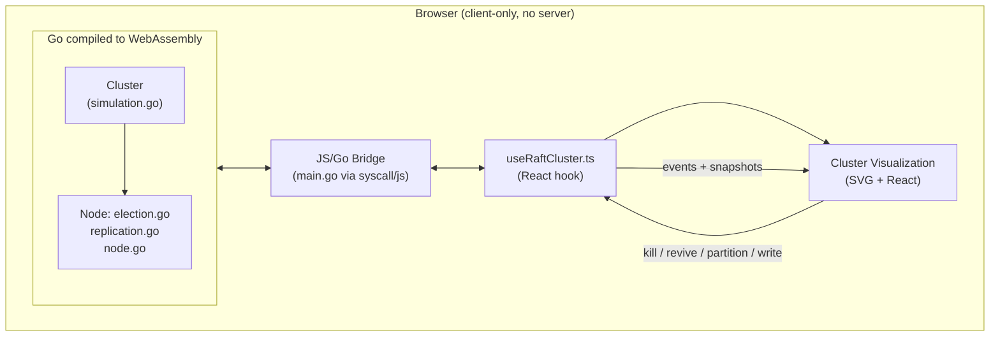

# Raftline

A live, interactive implementation of the **Raft consensus algorithm** — the protocol that lets distributed systems like etcd, CockroachDB, and Consul keep multiple machines agreeing on the same data, even when machines crash or the network fails.

The core algorithm is implemented in Go, compiled to **WebAssembly**, and runs entirely client-side — no backend server, no database. The simulation itself is real: actual election timeouts, actual RPC latency, actual log replication, running in your browser.

**[Live demo →](your-vercel-url-here)**


## What this demonstrates

Most Raft implementations either stay purely theoretical (a paper walkthrough) or purely textual (log output in a terminal). Raftline is built to make Raft's actual hard edge cases — the ones tutorials usually skip — visible and interactive:

- **Split-brain detection** — a partitioned-away leader has no way to know it's been replaced, so it keeps believing it's in charge. Raftline detects and visually flags this, and correctly routes writes to the legitimate (highest-term) leader.
- **Quorum loss** — kill enough nodes, or partition the network unevenly, and the cluster correctly *refuses* to elect a leader rather than risk split-brain writes. This is a deliberate safety trade-off in Raft, not a bug.
- **Convergent replication** — a real key-value state machine applies committed log entries, so you can watch state actually converge across nodes after a partition heals.

## Architecture



**Why WASM, not a real backend?** This project simulates a distributed cluster's internal behavior — timers, concurrent goroutines, simulated network latency and partitions — rather than actually running five separate processes. Compiling the real Go implementation to WebAssembly means the algorithm running in your browser is the *exact same code* that passes the Go test suite, not a JavaScript reimplementation.

## Key engineering challenges

**Browser tab throttling caused runaway elections.** Go compiled to WASM has no real OS threads — its scheduler relies on JS timers to wake sleeping goroutines. Chrome throttles `setTimeout` heavily in backgrounded/idle tabs, so election timeouts across all nodes would fire in a burst the moment the tab regained focus, causing a cascading storm of spurious elections. Fixed by pausing the simulation entirely on `visibilitychange` and resuming with freshly reset timers, rather than trying to compensate for throttled timing after the fact.

**Go's map iteration order is randomized.** The cluster snapshot was being built via `for id, n := range c.nodes`, which meant the frontend received nodes in a different order on every single poll — causing visualization nodes to visually "jump" between positions. Fixed by sorting snapshots by node ID before returning them.

## Features

- Real Raft core: leader election, log replication, heartbeats, randomized election timeouts with per-node stagger
- Simulated network: randomized RPC latency (5-50ms, tracked as a live rolling average), on-demand network partitions
- Fault injection: kill/revive any node, partition the network into arbitrary groups, heal on demand
- Live cluster visualization: SVG diagram with animated RPC traffic, heartbeat pulses, election/vote animations, per-node replication progress
- Key-value state machine: committed writes are actually applied and visible per-node
- Split-brain and quorum-loss detection, visualized explicitly rather than silently
- Time-travel scrubber over recent cluster history
- Adjustable cluster size (3 / 5 / 7 nodes) to explore how majority requirements change
- One-click scripted chaos demo (kill leader → elect → recover)
- Full Go test suite: full lifecycle, no-split-brain-during-partition, no-spurious-elections-when-idle

## Tech stack

| Layer | Technology |
|---|---|
| Consensus core | Go |
| Browser runtime | WebAssembly (`GOOS=js GOARCH=wasm`) |
| Frontend | Next.js, React, TypeScript |
| Visualization | Hand-built SVG (no charting library) |

## Scope and known limitations

This is a simulation built for demonstrating and visualizing Raft's behavior, not a production-ready consensus library. Explicitly out of scope:

| Not implemented | Why |
|---|---|
| Persistent storage / disk-backed logs | State is in-memory only, matching a simulation's needs |
| Log compaction / snapshotting for real storage | Not needed at the log sizes this demo produces |
| Cluster membership changes (adding/removing nodes at runtime) | Cluster size is fixed per session; resizing tears down and rebuilds |
| Real network transport (gRPC/TCP) | RPCs are simulated in-process with artificial latency |

## Running locally

**Prerequisites:** Go 1.21+, Node.js 18+

```bash
# Build the WASM binary
cd go-raft
GOOS=js GOARCH=wasm go build -o ../web/public/main.wasm ./_wasm

# Run the Go test suite
go test ./... -v

# Run the frontend
cd ../web
npm install
npm run dev
```

Then open `http://localhost:3000`.

## Project structure

```
raftline/
├── go-raft/              # Raft core, in Go
│   ├── node.go           # Node struct, state machine
│   ├── election.go       # Leader election logic
│   ├── replication.go    # Log replication (AppendEntries)
│   ├── simulation.go     # Cluster: concurrency, fault injection, timers
│   ├── _wasm/main.go     # JS/Go bridge (syscall/js)
│   └── *_test.go         # Test suite
└── web/                  # Next.js frontend
    └── src/
        ├── components/   # ClusterVisualization, HealthMeter, etc.
        ├── lib/          # useRaftCluster hook, sound, layout helpers
        └── app/          # Page
```